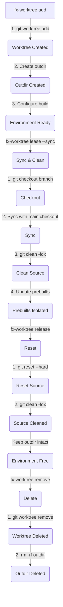

# fx-worktree (Fuchsia Worktree Manager)

`fx-worktree` is a stateless, concurrent-safe CLI tool designed to provision
instantaneous, isolated development environments for parallel agents working on
Fuchsia.


---

## Why fx-worktree?

Fuchsia is a massive codebase. Standard development workflows often suffer
from:
*   **State corruption**: Sharing a single build directory between parallel
    tasks or agents leads to clobbered builds and race conditions.
*   **Resource waste**: Recreating environments from scratch for every task is
    itself inefficient.

`fx-worktree` solves these problems by pooling persistent **Worktrees** (git
worktrees) and pairing them 1:1 with dedicated Fuchsia **outdirs** (build
output directories). This ensures:
*   **Isolation**: Parallel agents work in completely separate environments,
    preventing state leakage.
*   **Instantaneous setups**: Leasing a pre-warmed workspace takes seconds.
*   **Extreme speed**: Reusing existing workspaces preserves Ninja build
    timestamps and remote compiler caches, enabling **no-op incremental
    builds in under 3 seconds**.

---

## Technical Rationale: 1:1 Worktree to Outdir Pairing

A core design principle of `fx-worktree` is the strict **1:1 pairing between
a Git Worktree and a Fuchsia Output Directory (`outdir`)**.

### The Problem with Shared Build Directories
In Fuchsia, the build configuration (`args.gn`) and build artifacts are stored
in the `outdir`. This configuration contains absolute paths referencing the
source tree (the worktree).
*   **Path Invalidations**: If multiple worktrees shared a single `outdir`,
    switching between worktrees would constantly invalidate build paths,
    forcing GN to regenerate and Ninja to re-compile most of the codebase.
    This destroys the possibility of incremental builds.
*   **State Desynchronization**: If a single worktree tried to use multiple
    `outdirs` dynamically, the build state would become desynchronized,
    leading to unexpected rebuilds or build failures.

### The 1:1 Solution
`fx-worktree` manages this complexity by ensuring that when a worktree is
created, a dedicated `outdir` is provisioned alongside it.
*   **Persistent Association**: The worktree is permanently paired with its
    dedicated `outdir`.
*   **No-Op Incremental Builds**: Because the source files and build artifacts
    remain in sync, subsequent builds in the same leased environment can
    determine that nothing has changed and complete in **less than 3
    seconds**.

## Technical Rationale: Prebuilt Isolation and Shared Cache

Fuchsia checkouts contain hundreds of prebuilt packages (toolchains, SDKs,
firmware) managed by Jiri and CIPD. Sharing the parent's `prebuilt/` directory
causes workspaces to dirty each other's builds when the parent updates.

To isolate them while retaining cache sharing, `fx-worktree`:
1.  **Queries Required Packages**: Queries the required packages for the
    workspace's revision using `jiri package` locally.
2.  **Groups by Target Path**: Groups packages by their target path. This is
    critical because Jiri allows multiple packages to overlap in the same
    destination (e.g., Rust host compiler and target libraries both install to
    `prebuilt/third_party/rust/linux-x64`).
3.  **Uses a Shared Cache**: Installs packages into a central cache at
    `~/.fuchsia/worktrees/shared-prebuilts/merged/<target_path>/<hash>/`.
    The hash is a SipHash of the sorted package names and versions in the
    group, ensuring different workspaces on the same revision share the exact
    same merged directories.
4.  **Clamps modification times (mtimes)**: Some prebuilt packages contain
    files with artificial modification times in the far future (e.g., Bazel
    uses `2042-07-28` for determinism). Since Ninja tracks these as dynamic
    inputs (recorded in `.ninja_deps`), they always trigger rebuilds because
    today's build outputs are older than `2042`. To fix this, `fx-worktree`
    recursively clamps the modification times of all files in newly downloaded
    cache directories to a fixed past date (`2020-01-01 00:00:00 UTC`),
    preserving build cache no-ops.
5.  **Symlinks to Workspace**: Symlinks individual package target directories
    in the workspace to their corresponding directory in the shared cache.
6.  **Manually Extracts Wheels**: Some dependencies (like `pydantic-core` and
    `protobuf-py3`) are distributed as CIPD wheel packages but extracted into
    the source tree by Jiri hooks. Since we isolate `prebuilt/` and avoid
    Jiri's slow `run-hooks` (which triggers network fetches), `fx-worktree`
    manually runs the local wheel extraction scripts
    (`extract_pydantic_core_wheel.sh` and `extract_protobuf_py3_wheel.sh`)
    during allocation to extract them locally in the workspace.

---

## Under the Hood: Automated Lifecycle

`fx-worktree` automates a complex sequence of Git and Fuchsia build system
operations to ensure environments are clean, isolated, and fast.



### Detailed Lifecycle Steps

#### 1. Creation (`fx-worktree add`)
When you add a new environment, the tool:
1.  **Creates a Git Worktree**: Runs `git worktree add` to create a new
    checkout linked to the main repository.
2.  **Provisions an Outdir**: Creates a dedicated build output directory in
    the Fuchsia build directory pool.
3.  **Links and Configures**: Configures the build in the new `outdir` to
    point to the new worktree, performing the equivalent of `fx set` to
    establish the 1:1 pairing.

#### 2. Leasing and Syncing (`fx-worktree lease --sync`)
When an agent leases an environment with the `--sync` flag, the tool
performs a carefully orchestrated sync to ensure the environment is updated
while preserving build incrementalism:
1.  **Locks the Environment**: Claims the environment to prevent concurrent
    access by other agents.
2.  **Records Git Index mtimes**: Before running any Git operations, the
    tool records the modification times (`mtimes`) of the Git index files.
3.  **Fast No-Op Detection**: It checks if the workspace is already at the
    target revision and clean. If it is, the tool skips Git updates entirely.
4.  **Syncs Source**: If not a no-op, it syncs the worktree's Git state with
    the main Fuchsia checkout to the target Jiri revisions, updating the root
    project and all sub-projects in parallel.
5.  **Cleans Stale Files**: Runs `git clean` (excluding the paired `outdir`
    and special markers) to discard untracked files.
6.  **Isolates and Clamps Prebuilts**: Resolves prebuilt packages via CIPD.
    To prevent prebuilt updates from invalidating build caches, the tool:
    *   Downloads missing packages to a shared cache.
    *   **Clamps mtimes to the past**: Modifies the modification times of the
        prebuilt files to a historical timestamp. This ensures Ninja treats
        them as older than any build output.
    *   Symlinks or copies them into the worktree.
7.  **Restores Git Index mtimes**: If the sync was determined to be a no-op,
    the tool restores the recorded Git index `mtimes`. This prevents Git from
    thinking files have changed, which would otherwise trigger GN and Ninja to
    rebuild.

#### 3. Releasing (`fx-worktree release`)
When work is complete and the environment is released:
1.  **Resets Git State**: Runs `git reset --hard` and `git clean` to discard
    any uncommitted local changes, returning the source tree to a pristine
    state.
2.  **Preserves Build Artifacts**: Critically, the paired `outdir` is **not**
    deleted. Build artifacts, Ninja logs, and compiler caches are preserved.
3.  **Unlocks**: Marks the environment as "Free", making it available for
    the next lease. The next agent leasing this environment will benefit from
    the preserved build state, achieving near-instantaneous incremental
    builds.

#### 4. Deletion (`fx-worktree remove`)
When an environment is no longer needed:
1.  **Removes Git Worktree**: Runs `git worktree remove` to clean up the Git
    metadata and delete the source files.
2.  **Deletes Outdir**: Recursively deletes the paired `outdir`, freeing up
    significant disk space.

---

## Installation

Compile and install the binary locally:
```bash
cargo install --path . --force
```

### Zsh Shell Integration (Required for `fx-worktree cd`)
Add the shell wrapper function to your `~/.zshrc` to support the directory
navigation feature:

```zsh
# fx-worktree shell wrapper for cd command
fx-worktree() {
    if [[ "$1" == "cd" ]]; then
        local target_path
        target_path=$(command fx-worktree locate "$2")
        if [[ $? -eq 0 && -n "$target_path" ]]; then
            cd "$target_path"
        else
            return 1
        fi
    else
        command fx-worktree "$@"
    fi
}
```

Set up Zsh completions (optional):
```bash
mkdir -p ~/.zsh/completion
fx-worktree completions zsh > ~/.zsh/completion/_fx-worktree
# Add ~/.zsh/completion to your fpath in ~/.zshrc before compinit
```

---

## Commands and Usage

### 1. Add a Worktree
Add a new worktree with a dedicated outdir.
```bash
fx-worktree add <config_name>
```

### 2. Lease a Worktree
Lease a worktree to start work.
```bash
fx-worktree lease <config_name> [--agent-id <agent_name>] [--sync] [--json]
```
*   `--sync`: Opt-in to update the worktree to the latest code in the main
    fuchsia checkout, clean it, and download/isolate prebuilts.

*   **Default Output (Human Friendly):**
    ```none
    ✔ Worktree leased successfully!

      ℹ Worktree ID    : fuchsia_internal.x64_d704c897-f2f2-4a6b-8a95-16d74d9788a5
      ℹ Agent ID       : agent-2f26359d
      ℹ Config         : fuchsia_internal.x64
      ℹ Path           : /home/user/.fuchsia/worktrees/environments/fuchsia_internal.x64_d704c897-f2f2-4a6b-8a95-16d74d9788a5

    To change directory into the worktree:
      $ fx-worktree cd fuchsia_internal.x64_d704c897-f2f2-4a6b-8a95-16d74d9788a5  # Navigate to this specific worktree
      $ fx-worktree cd                     # Navigate to the last leased worktree
    ```

*   **JSON Output (via `--json`):**
    ```json
    {"environment_id":"fuchsia_internal.x64_d704c897-f2f2-4a6b-8a95-16d74d9788a5","agent_id":"agent-2f26359d","config":"fuchsia_internal.x64","pid":2549294,"timestamp_sec":1779221652,"path":"/home/user/.fuchsia/worktrees/environments/fuchsia_internal.x64_d704c897-f2f2-4a6b-8a95-16d74d9788a5"}
    ```

### 3. Update a Worktree (Sync)
Update a worktree to the latest code in the main fuchsia checkout.
```bash
fx-worktree sync <worktree_id>
```

### 4. List Worktrees
List worktrees.
```bash
fx-worktree list [--json]
```

*   **Default Output:**
    ```none
    CONFIG                 WORKTREE ID                                        STATUS
    fuchsia.x64            fuchsia.x64_37954053-f927-45f1-9086-01d7b07c35bf   Free
    fuchsia_internal.x64   fuchsia_internal.x64_d704c897-f2f2-4a6b-8a95...    In Use (agent_1)
    ```

### 5. Release a Worktree
Release and reset a worktree (does a git reset).
```bash
fx-worktree release <worktree_id> [--json]
```

### 6. Remove a Worktree
Remove a worktree and its dedicated outdir.
```bash
fx-worktree remove <worktree_id>
```

### 7. Change Directory into Worktree
Change directory to a worktree (shell wrapper required).
```bash
fx-worktree cd [worktree_id]
```

### 8. Run Self-Test
Runs a programmatic verification of the `fx-worktree` lifecycle (leasing,
build regeneration, cache preservation, and cleanup) using an existing
worktree.
```bash
fx-worktree self-test <worktree_id>
```
> [!IMPORTANT]
> The target worktree must be "Free" (not leased by any agent) and should
> ideally be "warmed" (built at least once) to run the test quickly.
